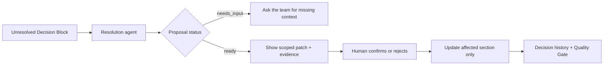
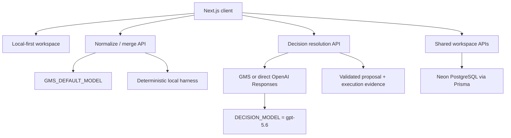

# PlanMerge

> **Git merge for team decisions, not just documents.** PlanMerge combines AI-generated planning drafts into one source-traceable plan, exposes disagreements instead of silently flattening them, and gives people the final say in a Decision Room.

[Live demo](https://planmerge-ai.vercel.app) · [Source](https://github.com/whtjddlr/planmerge-ai) · [Product specification](docs/planmerge-v0.1-spec.md) · [ERD](docs/planmerge-v0.1-erd.mmd)

**OpenAI Build Week category:** Work & Productivity

## The problem

Product teams increasingly ask several people—and several AI tools—to draft the same plan. A generic LLM can produce a polished synthesis, but it usually hides the decisions that matter:

- Which proposal made it into the final plan?
- Which alternatives were rejected?
- Where did two contributors disagree?
- Which original passage supports each conclusion?
- Who resolved an important trade-off, and what changed afterward?

PlanMerge treats those questions as product data. Every section is backed by Decision Blocks that preserve the selected option, alternatives, conflicts, rationale, and source excerpts.

## Two-minute judge path

The hosted demo is designed to work without account setup.

1. Open the [live demo](https://planmerge-ai.vercel.app) and load the verified sample from the first screen.
2. Review the merge summary: 13 role-specific drafts, 12 final sections, complete source coverage, and one intentionally planted MVP-scope conflict.
3. Open the conflict between a text-first MVP and a launch that includes external integrations.
4. Enter the **Decision Room** and request a resolution proposal.
5. Check the evidence panel before applying anything: it shows the response provider (`gms` or `openai`), exact model, response ID when supplied upstream, generation time, and the option/source IDs used as support.
6. If the proposal is applicable, confirm the human decision and review the scoped section patch. The rest of the plan remains unchanged.
7. Inspect the resulting decision history and Quality Gate. A local fallback is visibly labeled and can never be applied as an AI-backed resolution.

The intended “magic moment” is simple: a generic merger silently chooses a side; PlanMerge stops, shows the disagreement, asks for a human decision, changes only the affected section, and preserves why it changed.

## OpenAI Build Week disclosure

PlanMerge existed before OpenAI Build Week. The baseline is intentionally explicit so judges can evaluate only the work completed during the Submission Period.

### Before Build Week

Baseline: [`446d2f5`](https://github.com/whtjddlr/planmerge-ai/tree/446d2f5) (`main`, July 8, 2026).

That baseline already included:

- multi-draft intake and a two-stage normalize/merge pipeline;
- source-linked Decision Blocks, conflict detection, and a Quality Gate;
- anonymous votes and opinions, human override, export, and shared snapshots;
- schema validation, repair, deterministic fallback, and quality-harness cases.

### Built during OpenAI Build Week

The Build Week extension closes the gap between **detecting** disagreement and **resolving** it:

- a focused Decision Room for unresolved Decision Blocks;
- a decision-resolution agent configured with `DECISION_MODEL=gpt-5.6` (with `GMS_DECISION_MODEL` retained as a compatibility fallback);
- a `POST /api/decision-blocks/:decisionBlockId/resolution` endpoint with a typed `DecisionResolutionResult` contract;
- `ready` versus `needs_input` proposals and a patch scoped to the affected section;
- server-provided execution evidence: `source`, exact `model`, optional `responseId`, `generatedAt`, and supporting option/source IDs;
- an honest non-applicable local fallback when a real model response is unavailable;
- regression coverage and documentation for the new resolution path.

The pre-existing merge pipeline remains useful context, but the Decision Room and its resolution/evidence flow are the hackathon submission work.

## Decision Room

The Decision Room is deliberately not an autonomous approval bot.



The resolution agent must:

- use only the supplied project criteria, Decision Block options, and source evidence;
- preserve dissent and identify missing context rather than inventing it;
- return `needs_input` when the evidence is insufficient;
- produce a patch only for the section connected to the Decision Block;
- expose supporting option and source IDs for server validation;
- leave the final decision and application step to a person.

See [the decision-resolution agent contract](docs/agents/decision-resolution-agent.md) for the complete behavior and safety rules.

## GPT-5.6 usage and verifiable response evidence

PlanMerge uses an OpenAI-compatible Responses endpoint through GMS. The existing normalization/merge path and the new Decision Room are configured separately so the Build Week model choice is explicit.

When `OPENAI_API_KEY` is used, the Decision Room calls the official OpenAI `/v1/responses` endpoint directly; the quickstart does not require a separate OpenAI URL variable. The returned `source` field makes the provider used for each proposal visible.

| Path | Environment variable | Default | Purpose |
|---|---|---|---|
| Existing draft normalization and merge | `GMS_DEFAULT_MODEL` | `gpt-4.1` | Pre-existing document-analysis pipeline |
| Build Week Decision Room | `DECISION_MODEL` | `gpt-5.6` | Provider-neutral conflict-resolution model |
| Compatibility alias | `GMS_DECISION_MODEL` | none | Used only when `DECISION_MODEL` is unset |

The UI does not infer model usage from a client-side label. The resolution API returns a `DecisionResolutionResult` with:

- `source`: `gms`, `openai`, or `local_fallback`;
- `model`: the exact model associated with the response;
- `responseId`: the upstream response identifier when available;
- `generatedAt`: the server-recorded generation time;
- `proposal`: a `ready` or `needs_input` result with supporting option/source IDs;
- `warning`: an explicit degradation message when applicable;
- `applicable`: whether the proposal may be applied.

Only a validated real response can be applicable. If the API key is missing, the upstream request fails, or validation rejects the output, PlanMerge returns `source: "local_fallback"`, a warning, and `applicable: false`. It never presents fallback content as GPT-5.6 output.

## Core product capabilities

| Capability | What it does |
|---|---|
| Decision Trace | Tracks the selected option, rationale, alternatives, conflicts, and source excerpts for every section |
| Decision Block | Represents one planning topic as a structured, reviewable decision unit |
| Multi-draft Intake | Accepts drafts created by different people, roles, and AI tools in one schema |
| Two-stage AI Pipeline | Normalizes each draft, then merges canonical ideas into Decision Blocks and final sections |
| Conflict Detection | Surfaces disagreements and conflicts with project constraints instead of flattening them |
| Decision Room | Produces a grounded, scoped resolution proposal while preserving human authority |
| Quality Gate | Scores section coverage, source coverage, and option traceability; blocked work cannot be approved or shared |
| Anonymous Participation | Collects one vote per participant and free-form opinions on shared Decision Blocks |
| Human Override | Lets a reviewer replace the selected option while recording the change in decision history |
| Share and Export | Shares a Neon-backed workspace snapshot and exports Markdown or workspace JSON |

## Reliability and safety design

Model output is treated as untrusted data, not as an instruction or a source of truth.

```text
GMS Responses API
  -> role-specific prompt
  -> JSON protocol validation
  -> enum / ID / source-reference checks
  -> canonical server post-processing
  -> one repair attempt where supported
  -> explicit local fallback or non-applicable result
```

| Risk | Guardrail |
|---|---|
| Unsupported claims | Every decision option and resolution proposal must reference known option/source IDs |
| Hidden minority view | Alternatives and conflicts remain first-class options |
| Prompt injection in a draft | Project fields, draft text, and opinions are explicitly treated as untrusted input |
| Broken structured output | Validation rejects malformed responses; the merge pipeline can attempt one repair |
| False model attribution | Provider and exact execution evidence come from the server response; fallback is visibly distinct and non-applicable |
| Over-broad rewrite | A resolution patch is limited to the affected final-document section |
| Cost exhaustion | AI routes use IP-based rate limits with an Upstash or in-memory implementation |
| Duplicate shared vote | A database uniqueness constraint covers workspace, Decision Block, and anonymous participant key |

The shared product principles and role index live in [docs/planmerge-product-agent-manual.md](docs/planmerge-product-agent-manual.md).

## Architecture



| Layer | Technology |
|---|---|
| Framework | Next.js 16 App Router, React 19, TypeScript |
| Styling | Tailwind CSS 4 |
| AI | GMS OpenAI-compatible or direct OpenAI Responses endpoint |
| Database | Neon PostgreSQL |
| ORM | Prisma 7 |
| Deployment | Vercel |
| Local state | `localStorage` workspace with shared database snapshots |

## Run locally

Prerequisites: Node.js, npm, and optionally GMS/Neon credentials.

```bash
npm ci
cp .env.example .env.local
npm run dev
```

Open `http://localhost:3000`.

- Without `GMS_API_KEY`, the existing merge experience can use its deterministic local harness.
- Decision Room execution can use either the existing GMS credential or a server-side `OPENAI_API_KEY`.
- Without a real Decision Room model response, a resolution result is non-applicable by design.
- Without `DATABASE_URL`, local workspaces still work; database-backed sharing is disabled.

### Environment variables

| Variable | Purpose | Default or behavior when absent |
|---|---|---|
| `GMS_API_KEY` | Server-side GMS credential | AI calls degrade to their documented fallback behavior |
| `GMS_API_URL` | OpenAI-compatible Responses endpoint | GMS endpoint in `.env.example` |
| `OPENAI_API_KEY` | Optional direct OpenAI Responses credential for Decision Room | The route can use GMS when configured; otherwise resolution degrades honestly |
| `GMS_DEFAULT_MODEL` | Existing normalization/merge model | `gpt-4.1` |
| `DECISION_MODEL` | Build Week Decision Room model | `gpt-5.6` |
| `GMS_DECISION_MODEL` | Legacy compatibility alias | Read only when `DECISION_MODEL` is unset |
| `DATABASE_URL` | Neon pooled runtime connection | Sharing unavailable |
| `DIRECT_URL` | Neon direct Prisma connection | Falls back to `DATABASE_URL` for Prisma commands |
| `AUTH_SECRET`, `AUTH_GITHUB_ID`, `AUTH_GITHUB_SECRET` | Optional GitHub authentication | Guest mode |
| `ANON_KEY_SECRET` | HMAC secret for anonymous participation keys | Development behavior only; configure in production |
| `UPSTASH_REDIS_REST_URL`, `UPSTASH_REDIS_REST_TOKEN` | Distributed rate limiting | In-memory rate limiter |

Never expose `GMS_API_KEY`, `OPENAI_API_KEY`, database URLs, or authentication secrets to the browser or commit them to the repository.

## Verification

```bash
npm run lint
npm run harness:quality
npm run build
```

`harness:quality` exercises source coverage, known conflicts, missing evidence, prompt injection, malformed drafts, and Decision Room resolution invariants without requiring a paid model call. The hosted judge path is the separate proof that a real response was used: check `source`, `model`, `responseId` when available, `generatedAt`, and supporting IDs in the evidence panel.

## API surface

| Method | Route | Purpose |
|---|---|---|
| `POST` | `/api/analyze/planmerge` | Normalize drafts, merge decisions, and generate final sections |
| `POST` | `/api/decision-blocks/:decisionBlockId/resolution` | Generate a validated Decision Room proposal and execution evidence |
| `POST` | `/api/workspaces` | Create a shareable workspace snapshot |
| `GET` | `/api/workspaces/:workspaceId` | Read a shared workspace |
| `POST` | `/api/workspaces/:workspaceId/votes` | Create or change an anonymous vote |
| `POST` | `/api/workspaces/:workspaceId/opinions` | Add an anonymous opinion |
| `GET` | `/api/workspaces/:workspaceId/participation` | Read vote and opinion aggregates |
| `POST` | `/api/decision-blocks/:decisionBlockId/opinion-clusters` | Cluster anonymous opinions |

## How Codex contributed during Build Week

The majority of the Build Week extension was developed in a primary Codex thread; its `/feedback` Session ID is supplied in the Devpost submission. Codex was used to:

- audit the pre-existing product against the hackathon requirements;
- turn the Decision Room concept into a typed protocol, API boundary, UI flow, and regression cases;
- trace existing source/Decision Block invariants before extending them;
- implement and review the scoped-resolution path across server and client boundaries;
- update the setup, agent, judging, and Build Week disclosure documentation;
- run the repository verification commands and investigate failures.

The builder retained the key product decisions: the model may prepare a resolution but cannot approve it; fallback output may not masquerade as GPT-5.6; and applying a decision must not rewrite unrelated sections.

## Limitations

- The default template is optimized for a 12-section Korean software-service plan.
- Shared workspaces use snapshots rather than real-time collaborative editing.
- The Decision Room assists one Decision Block at a time; it does not autonomously approve an entire plan.
- A real Decision Room proposal requires a configured GMS credential and access to the configured model.

## License

PlanMerge is available under the [MIT License](LICENSE).
