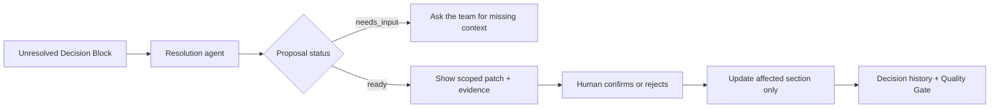
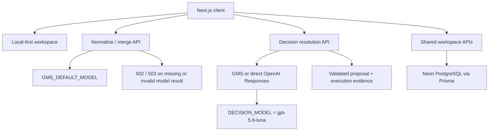

# PlanMerge

여러 기획 초안을 비교하고, 사용할 의견을 선택해 출처와 함께 하나의 문서로 정리하는 서비스입니다.
초안 입력 → 의견·대안 확인 → 선택 변경 → 문서 내보내기 순서로 사용합니다.

- [콘텐츠 기획 시나리오와 발견한 한계](docs/experiments/content-planning/README.md)
- 새 시나리오 재현: `npx tsx scripts/evaluate-content-scenarios.ts`
- 실제 로컬 API 검증: 서버 실행 후 `npx tsx scripts/evaluate-content-scenarios.ts --live`
- **앱에서 바로 설정**: 키 없이 앱을 열면 상단에 키 등록 배너가 뜹니다. OpenAI API 키를 붙여넣으면 검증 후 사용할 모델을 자동으로 골라 바로 분석할 수 있습니다. 키는 이 브라우저에만 저장되고, 분석 요청 때만 서버로 전달되어 요청이 끝나면 버려집니다. 서버·공유 링크·내보내기 파일에는 저장되지 않습니다. 등록한 키는 프로젝트 설정 화면의 "AI 연결"에서 바꾸거나 지울 수 있습니다.
- **서버에 키를 심으려면**: `npm run setup`을 실행하고 API 키를 붙여넣으면 키를 검증한 뒤 사용 가능한 모델을 골라 `.env.local`을 만들어 줍니다. 입력은 화면에 표시되지 않고 키는 이 기계 밖으로 나가지 않습니다. 서버에 키가 있으면 사용자에게 키를 묻지 않습니다.
- 직접 설정하려면 `.env.local`에 `OPENAI_API_KEY`, `ANALYSIS_PROVIDER=openai`, `OPENAI_ANALYSIS_MODEL=gpt-5.6-luna`를 넣습니다. 키는 커밋하지 않습니다.
- 분석 키가 없으면 분석 API는 `503`으로 실패합니다. 규칙 기반 결과를 성공처럼 반환하지 않습니다.

## 다음 작업: 영상 기획 모드

이 저장소는 영상 제작 워크플로우와 별도의 **기획서 서비스**입니다. 현재 `service_plan`은 서비스 기획을 위한 12개 항목을 사용합니다. 다음 에이전트는 이 구조를 깨지 않고 `video_plan`을 추가해 영상 기획 입력·비교·산출물을 분리합니다.

### 목표 사용 흐름

`영상 기획 선택 → 제작 조건 입력 → 여러 기획 초안 입력 → 콘셉트·조건 비교 → 충돌/미결정 확인 → 사람이 안 선택 → 영상 제작안 내보내기`

### 영상 기획에서 관리할 값

- 목적·핵심 메시지·타깃 시청자·게시 채널
- 영상 형식(가로/세로/정사각형), 목표 길이, 톤·레퍼런스
- 이야기 흐름(도입·전개·마무리), 장면/샷 목록, 장면별 역할
- 사용 가능한 소재, 새로 필요한 소재, 스포일러 범위
- 일정·예산·촬영/생성 제약, 미결정 사항
- 생성형 콘텐츠를 쓸 때 유지할 인물·의상·소품·공간·스타일

### 구현 순서

1. `ProjectSettings.documentType`에 `video_plan`을 추가하고 영상 전용 필드와 8~12개 섹션 정의를 만든다. 기존 `service_plan`의 문구와 결과 형식은 바꾸지 않는다.
2. 초안 정규화·병합 프롬프트를 `documentType`에 따라 분기한다. 영상 모드에서는 타깃·메시지·길이·비율·톤·스포일러·소재·장면 흐름을 비교한다.
3. 모델이 없는 정보(예산, 출연자, 장면, 성과)를 채우지 않도록 `missingSections`와 확인 질문으로 반환한다. 서로 양립하지 않는 타깃·길이·형식·제약은 Decision Block의 충돌로 표시한다.
4. 결과 화면은 `영상 제작안`으로 표시하고 콘셉트, 이야기 흐름, 샷 목록, 소재 목록, 미결정 사항을 내보낸다. 서비스 기획 화면의 `MVP 범위` 같은 용어를 영상 모드에서 그대로 노출하지 않는다.
5. OpenAI 응답의 실제 `source`, `model`, 응답 시각을 보존한다. 모델 결과를 만들지 못하면 실패로 반환하고, 규칙 기반 결과를 의미 판단인 것처럼 표시하지 않는다. 사람의 선택과 선택 이유를 기록한다.

### 반드시 재현할 테스트

- 짧은 메모 하나: 없는 정보는 빈칸/확인 질문으로 남는가?
- 신규 시청자용 세로 30초 티저와 기존 팬용 가로 3분 해설: 타깃·길이·스포일러 충돌이 드러나는가?
- 제작 기간 3일에서 1일로 변경: 소재·샷·일정이 다시 검토되는가?
- 기존 예고편만 사용 가능하지만 신규 인터뷰를 제안한 초안: 제약 위반으로 표시되는가?
- 선택을 바꾼 뒤 관련 섹션만 바뀌고 다른 섹션·출처·원문 발췌가 유지되는가?

검증은 `npx tsx scripts/evaluate-content-scenarios.ts`로 재현하고, OpenAI 키가 설정된 경우에만 `--live`를 사용한다. HTTP 200이나 JSON 유효성만으로 영상 기획 품질을 통과시키지 않는다. 영상 결과물 생성과 화질 평가는 이 저장소의 범위가 아니다.

### 다음 에이전트의 시작점

- 먼저 `AGENTS.md`, `docs/agents/`, `docs/experiments/content-planning/README.md`를 읽는다.
- `service_plan` 회귀 테스트를 먼저 실행한 뒤 영상 모드 코드를 추가한다.
- 완료 기준은 `npm run harness:quality`, `npm run lint`, `npm run build` 통과와 위 시나리오의 입력·결과 기록이다.

아래는 기존 Build Week 제출 이력과 기술 설명입니다.

> **Git merge for team decisions, not just documents.** PlanMerge combines AI-generated planning drafts into one source-traceable plan, exposes disagreements instead of silently flattening them, and gives people the final say in a Decision Room.

[Live demo](https://planmerge-ai.vercel.app) · [Source](https://github.com/whtjddlr/planmerge-ai) · [Product specification](docs/planmerge-v0.1-spec.md) · [ERD](docs/planmerge-v0.1-erd.mmd)

**OpenAI Build Week category:** Work & Productivity

## The problem

Product teams increasingly ask several people—and several AI tools—to draft the same plan. A generic LLM can produce a polished synthesis, but it usually hides the decisions that matter:

- Which proposal made it into the final plan?
- Which alternatives were rejected?
- Where did two contributors disagree?
- Which original passage supports each conclusion?
- Who resolved an important trade-off, and what changed afterward?

PlanMerge treats those questions as product data. Every section is backed by Decision Blocks that preserve the selected option, alternatives, conflicts, rationale, and source excerpts.

## Two-minute judge path

The hosted demo is designed to work without account setup.

1. Open the [live demo](https://planmerge-ai.vercel.app) and load the verified sample from the first screen.
2. Review the merge summary: 13 role-specific drafts, 12 final sections, complete source coverage, and one intentionally planted MVP-scope conflict.
3. Open the conflict between a text-first MVP and a launch that includes external integrations.
4. Enter the **Decision Room** and request a resolution proposal.
5. Check the evidence panel before applying anything: it shows the response provider (`gms` or `openai`), exact model, response ID when supplied upstream, generation time, and the option/source IDs used as support.
6. If the proposal is applicable, confirm the human decision and review the scoped section patch. The rest of the plan remains unchanged.
7. Inspect the resulting decision history and Quality Gate. When a real model response cannot be produced, the request fails with an explicit error instead of returning rule-based content.

The intended “magic moment” is simple: a generic merger silently chooses a side; PlanMerge stops, shows the disagreement, asks for a human decision, changes only the affected section, and preserves why it changed.

## OpenAI Build Week disclosure

PlanMerge existed before OpenAI Build Week. The baseline is intentionally explicit so judges can evaluate only the work completed during the Submission Period.

### Before Build Week

Baseline: [`446d2f5`](https://github.com/whtjddlr/planmerge-ai/tree/446d2f5) (`main`, July 8, 2026).

That baseline already included:

- multi-draft intake and a two-stage normalize/merge pipeline;
- source-linked Decision Blocks, conflict detection, and a Quality Gate;
- anonymous votes and opinions, human override, export, and shared snapshots;
- schema validation, one repair attempt, explicit failure, and quality-harness cases.

### Built during OpenAI Build Week

The Build Week extension closes the gap between **detecting** disagreement and **resolving** it:

- a focused Decision Room for unresolved Decision Blocks;
- a decision-resolution agent configured with `DECISION_MODEL=gpt-5.6-luna` (with `OPENAI_DECISION_MODEL` and `GMS_DECISION_MODEL` retained as compatibility aliases);
- a `POST /api/decision-blocks/:decisionBlockId/resolution` endpoint with a typed `DecisionResolutionResult` contract;
- `ready` versus `needs_input` proposals and a patch scoped to the affected section;
- server-provided execution evidence: `source`, exact `model`, optional `responseId`, `generatedAt`, and supporting option/source IDs;
- an explicit `503`/`502` failure when a real model response is unavailable, rather than rule-based content presented as a result;
- regression coverage and documentation for the new resolution path.

The pre-existing merge pipeline remains useful context, but the Decision Room and its resolution/evidence flow are the hackathon submission work.

## Decision Room

The Decision Room is deliberately not an autonomous approval bot.


```mermaid
flowchart LR
    A["Unresolved Decision Block"] --> B["Resolution agent"]
    B --> C{"Proposal status"}
    C -->|"needs_input"| D["Ask the team for missing context"]
    C -->|"ready"| E["Show scoped patch + evidence"]
    E --> F["Human confirms or rejects"]
    F --> G["Update affected section only"]
    G --> H["Decision history + Quality Gate"]
```

The resolution agent must:

- use only the supplied project criteria, Decision Block options, and source evidence;
- preserve dissent and identify missing context rather than inventing it;
- return `needs_input` when the evidence is insufficient;
- produce a patch only for the section connected to the Decision Block;
- expose supporting option and source IDs for server validation;
- leave the final decision and application step to a person.

See [the decision-resolution agent contract](docs/agents/decision-resolution-agent.md) for the complete behavior and safety rules.

## GPT-5.6 usage and verifiable response evidence

PlanMerge uses an OpenAI-compatible Responses endpoint through GMS. The existing normalization/merge path and the new Decision Room are configured separately so the Build Week model choice is explicit.

When `OPENAI_API_KEY` is used, the Decision Room calls the official OpenAI `/v1/responses` endpoint directly; the quickstart does not require a separate OpenAI URL variable. The returned `source` field makes the provider used for each proposal visible.

| Path | Environment variable | Default | Purpose |
|---|---|---|---|
| Draft normalization and merge (OpenAI direct) | `OPENAI_ANALYSIS_MODEL` | `gpt-4.1` | Document-analysis pipeline |
| Draft normalization and merge (via GMS) | `GMS_DEFAULT_MODEL` | `gpt-4.1` | Document-analysis pipeline |
| Decision Room | `DECISION_MODEL` | `gpt-5.6-luna` | Provider-neutral conflict-resolution model |
| Compatibility aliases | `OPENAI_DECISION_MODEL`, `GMS_DECISION_MODEL` | none | Read only when `DECISION_MODEL` is unset |

Reasoning models such as `gpt-5.6-luna` reject sampling parameters like `temperature`. The Responses client learns which parameters a model rejects from the upstream `400` response, drops them, retries, and caches that per model — so switching models does not require editing a hardcoded capability list.

The UI does not infer model usage from a client-side label. The resolution API returns a `DecisionResolutionResult` with:

- `source`: `gms` or `openai`;
- `model`: the exact model associated with the response;
- `responseId`: the upstream response identifier when available;
- `generatedAt`: the server-recorded generation time;
- `proposal`: a `ready` or `needs_input` result with supporting option/source IDs;
- `warning`: an explicit degradation message when applicable;
- `applicable`: whether the proposal may be applied.

Only a validated real response can be applicable. If the API key is missing the route returns `503`; if the upstream request fails or validation rejects the output it returns `502`, each with a machine-readable `code` and a Korean message. It never presents rule-based content as model output.

## Core product capabilities

| Capability | What it does |
|---|---|
| Decision Trace | Tracks the selected option, rationale, alternatives, conflicts, and source excerpts for every section |
| Decision Block | Represents one planning topic as a structured, reviewable decision unit |
| Multi-draft Intake | Accepts drafts created by different people, roles, and AI tools in one schema |
| Two-stage AI Pipeline | Normalizes each draft, then merges canonical ideas into Decision Blocks and final sections |
| Conflict Detection | Surfaces disagreements and conflicts with project constraints instead of flattening them |
| Decision Room | Produces a grounded, scoped resolution proposal while preserving human authority |
| Quality Gate | Scores section coverage, source coverage, and option traceability; blocked work cannot be approved or shared |
| Anonymous Participation | Collects one vote per participant and free-form opinions on shared Decision Blocks |
| Human Override | Lets a reviewer replace the selected option while recording the change in decision history |
| Share and Export | Shares a Neon-backed workspace snapshot and exports Markdown or workspace JSON |

## Reliability and safety design

Model output is treated as untrusted data, not as an instruction or a source of truth.

```text
GMS Responses API
  -> role-specific prompt
  -> JSON protocol validation
  -> enum / ID / source-reference checks
  -> canonical server post-processing
  -> one repair attempt where supported
  -> explicit 502/503 failure when no validated model result exists
```

| Risk | Guardrail |
|---|---|
| Unsupported claims | Every decision option and resolution proposal must reference known option/source IDs |
| Hidden minority view | Alternatives and conflicts remain first-class options |
| Prompt injection in a draft | Project fields, draft text, and opinions are explicitly treated as untrusted input |
| Broken structured output | Validation rejects malformed responses; the merge pipeline can attempt one repair |
| False model attribution | Provider and exact execution evidence come from the server response; a missing or invalid response fails the request instead of being replaced by rule-based content |
| Over-broad rewrite | A resolution patch is limited to the affected final-document section |
| Cost exhaustion | AI routes use IP-based rate limits with an Upstash or in-memory implementation |
| Duplicate shared vote | A database uniqueness constraint covers workspace, Decision Block, and anonymous participant key |

The shared product principles and role index live in [docs/planmerge-product-agent-manual.md](docs/planmerge-product-agent-manual.md).

## Architecture


```mermaid
flowchart TB
    UI["Next.js client"] --> Local["Local-first workspace"]
    UI --> MergeAPI["Normalize / merge API"]
    UI --> ResolutionAPI["Decision resolution API"]
    MergeAPI --> DefaultModel["GMS_DEFAULT_MODEL"]
    ResolutionAPI --> DecisionProvider["GMS or direct OpenAI Responses"]
    DecisionProvider --> DecisionModel["DECISION_MODEL = gpt-5.6-luna"]
    ResolutionAPI --> Evidence["Validated proposal + execution evidence"]
    UI --> WorkspaceAPI["Shared workspace APIs"]
    WorkspaceAPI --> DB["Neon PostgreSQL via Prisma"]
    MergeAPI --> Failure["502 / 503 on missing or invalid model result"]
```

| Layer | Technology |
|---|---|
| Framework | Next.js 16 App Router, React 19, TypeScript |
| Styling | Tailwind CSS 4 |
| AI | GMS OpenAI-compatible or direct OpenAI Responses endpoint |
| Database | Neon PostgreSQL |
| ORM | Prisma 7 |
| Deployment | Vercel |
| Local state | `localStorage` workspace with shared database snapshots |

## Run locally

Prerequisites: Node.js, npm, and optionally GMS/Neon credentials.

```bash
npm ci
cp .env.example .env.local
npm run dev
```

Open `http://localhost:3000`.

- Without an analysis credential (`OPENAI_API_KEY` or `GMS_API_KEY`), analysis, opinion clustering, and the Decision Room all return `503`. The sample workspace still renders, labeled as pre-generated example data.
- Decision Room execution can use either the existing GMS credential or a server-side `OPENAI_API_KEY`.
- Without a validated model response, the Decision Room returns `502` rather than a non-applicable placeholder.
- Without `DATABASE_URL`, local workspaces still work; database-backed sharing is disabled.

### Environment variables

| Variable | Purpose | Default or behavior when absent |
|---|---|---|
| `GMS_API_KEY` | Server-side GMS credential | AI routes return `503` |
| `GMS_API_URL` | OpenAI-compatible Responses endpoint | GMS endpoint in `.env.example` |
| `OPENAI_API_KEY` | Direct OpenAI Responses credential for analysis, clustering, and Decision Room | The routes can use GMS when configured; otherwise they return `503` |
| `ANALYSIS_PROVIDER` | `openai` forces direct OpenAI calls | Inferred as `openai` when `OPENAI_API_KEY` is set |
| `OPENAI_ANALYSIS_MODEL` | Normalization, merge, and clustering model | `gpt-4.1` |
| `GMS_DEFAULT_MODEL` | Existing normalization/merge model | `gpt-4.1` |
| `DECISION_MODEL` | Decision Room model | `gpt-5.6-luna` |
| `OPENAI_DECISION_MODEL`, `GMS_DECISION_MODEL` | Compatibility aliases | Read only when `DECISION_MODEL` is unset |
| `DATABASE_URL` | Neon pooled runtime connection | Sharing unavailable |
| `DIRECT_URL` | Neon direct Prisma connection | Falls back to `DATABASE_URL` for Prisma commands |
| `AUTH_SECRET`, `AUTH_GITHUB_ID`, `AUTH_GITHUB_SECRET` | Optional GitHub authentication | Guest mode |
| `ANON_KEY_SECRET` | Signed-in participants get a server-derived key, `HMAC-SHA256(secret, userId + workspaceId)`, so one account is one vote per workspace and workspaces cannot be linked. Guests keep their client key by design. | Signed-in users fall back to the client key and the server logs a warning; set it in production |
| `UPSTASH_REDIS_REST_URL`, `UPSTASH_REDIS_REST_TOKEN` | Distributed rate limiting | In-memory rate limiter |

Never expose `GMS_API_KEY`, `OPENAI_API_KEY`, database URLs, or authentication secrets to the browser or commit them to the repository.

## Verification

```bash
npm run lint
npm run harness:quality
npm run build
```

`harness:quality` exercises source coverage, known conflicts, missing evidence, prompt injection, malformed drafts, and Decision Room resolution invariants without requiring a paid model call. The hosted judge path is the separate proof that a real response was used: check `source`, `model`, `responseId` when available, `generatedAt`, and supporting IDs in the evidence panel.

## API surface

| Method | Route | Purpose |
|---|---|---|
| `GET` | `/api/analysis-config` | Report whether the server has an analysis credential |
| `POST` | `/api/analysis-config` | Verify a user-supplied key and return the model it can use |
| `POST` | `/api/analyze/planmerge` | Normalize drafts, merge decisions, and generate final sections |
| `POST` | `/api/decision-blocks/:decisionBlockId/resolution` | Generate a validated Decision Room proposal and execution evidence |
| `POST` | `/api/workspaces` | Create a shareable workspace snapshot |
| `GET` | `/api/workspaces/:workspaceId` | Read a shared workspace |
| `POST` | `/api/workspaces/:workspaceId/votes` | Create or change an anonymous vote |
| `POST` | `/api/workspaces/:workspaceId/opinions` | Add an anonymous opinion |
| `GET` | `/api/workspaces/:workspaceId/participation` | Read vote and opinion aggregates |
| `POST` | `/api/decision-blocks/:decisionBlockId/opinion-clusters` | Cluster anonymous opinions |

## How Codex contributed during Build Week

The majority of the Build Week extension was developed in a primary Codex thread; its `/feedback` Session ID is supplied in the Devpost submission. Codex was used to:

- audit the pre-existing product against the hackathon requirements;
- turn the Decision Room concept into a typed protocol, API boundary, UI flow, and regression cases;
- trace existing source/Decision Block invariants before extending them;
- implement and review the scoped-resolution path across server and client boundaries;
- update the setup, agent, judging, and Build Week disclosure documentation;
- run the repository verification commands and investigate failures.

The builder retained the key product decisions: the model may prepare a resolution but cannot approve it; rule-based output may not masquerade as a model result; and applying a decision must not rewrite unrelated sections.

## Limitations

- The default template is optimized for a 12-section Korean software-service plan.
- Analysis requires a configured model credential. There is no offline mode: without one, the analysis, clustering, and Decision Room routes fail explicitly.
- Shared workspaces use snapshots rather than real-time collaborative editing.
- The Decision Room assists one Decision Block at a time; it does not autonomously approve an entire plan.
- A real Decision Room proposal requires a configured GMS credential and access to the configured model.

## License

PlanMerge is available under the [MIT License](LICENSE).
