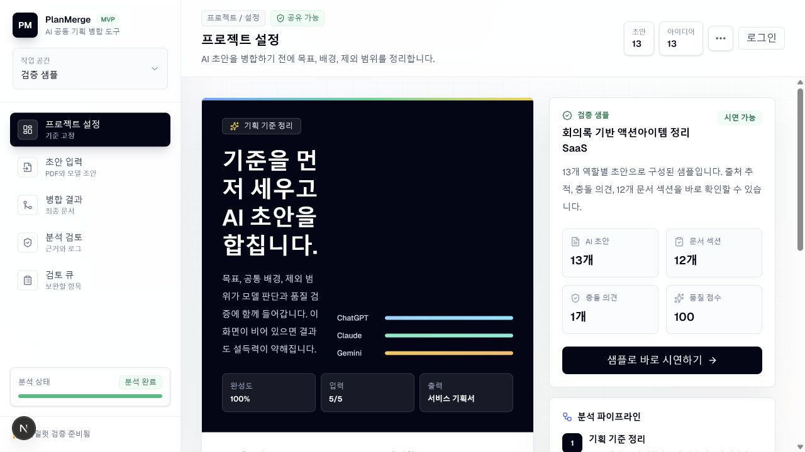
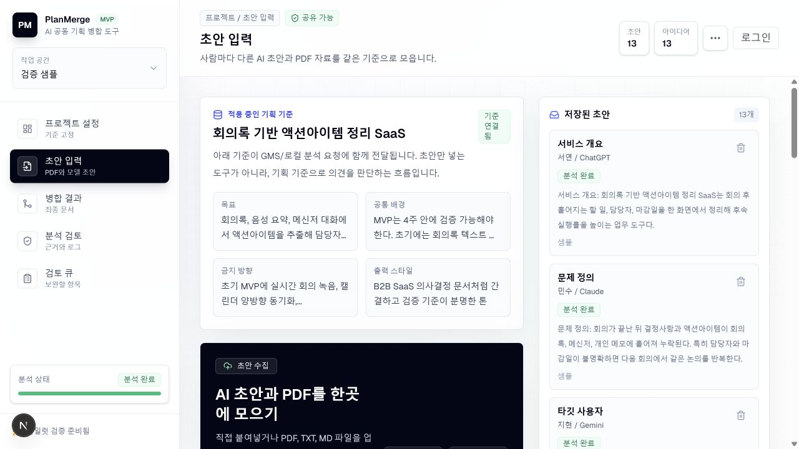
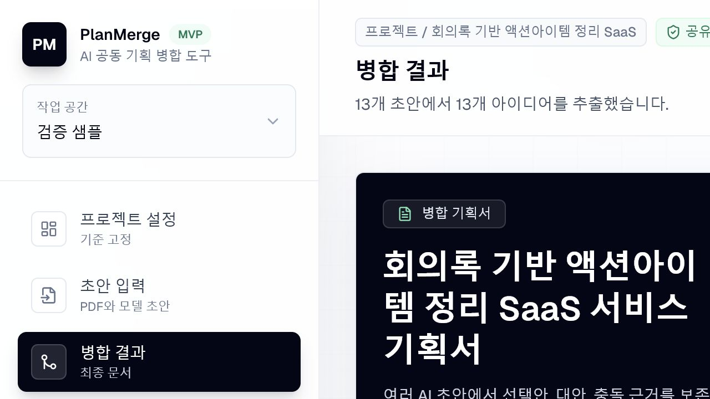
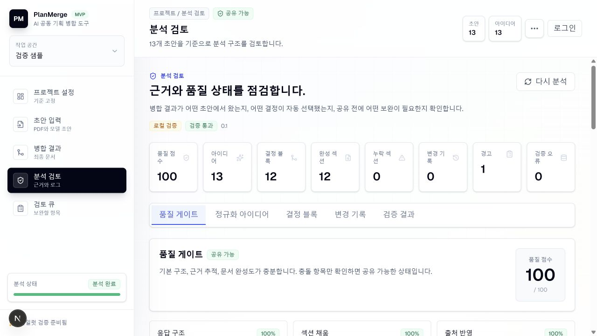
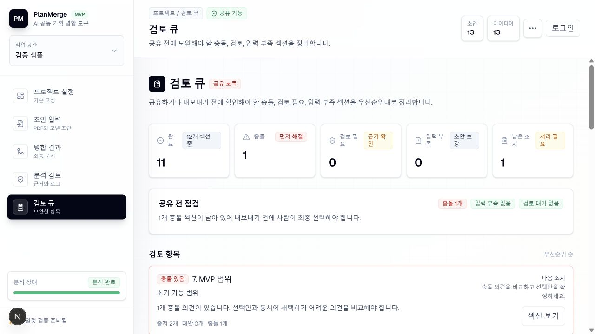
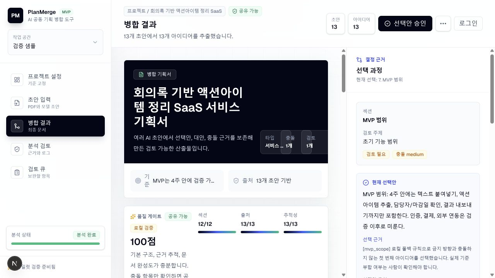
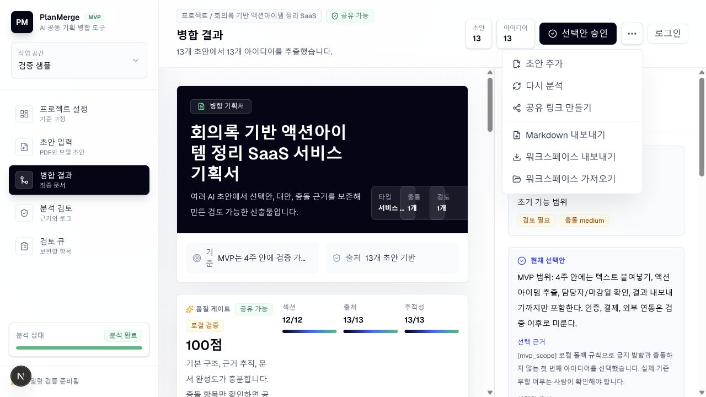

# PlanMerge 제품 흐름 점검

- 점검 일자: 2026-07-10
- 점검 범위: 기획 기준 설정 → 초안 수집 → 병합 결과 → 분석 검토 → 검토 큐 → 충돌 해결 → 공유/내보내기
- 사용자 목표: 여러 사람이 서로 다른 AI로 만든 초안을 하나의 신뢰 가능한 최종 기획서로 만들고, 남은 충돌을 확인한 뒤 공유한다.

## 전체 판단

현재 버전은 해커톤 데모와 3~5명 내부 파일럿에 충분한 기능을 갖췄다. 특히 기획 기준, 출처, 충돌, 검토 큐를 분리해 보여주는 구조가 좋다. 다음 완성도 상승은 장식보다 상태 모델과 최종 산출물 경험에서 나온다.

가장 큰 문제는 `문서 구조 품질`과 `공유 준비 상태`가 한 점수와 한 배지로 섞여 있다는 점이다. 샘플은 품질 점수 100점과 `공유 가능`을 표시하지만, 검토 큐에서는 충돌 1건 때문에 `공유 보류`라고 안내한다. 사용자는 어느 상태를 믿어야 하는지 판단하기 어렵다.

## 흐름별 점검

### 1. 기획 기준 설정 - 양호

- 목표, 배경, 금지 방향, 출력 스타일을 분석 전에 고정하는 흐름이 PlanMerge의 차별점을 잘 드러낸다.
- 샘플과 분석 파이프라인 설명이 있어 첫 시연 진입도 빠르다.
- 화면 이동 후 이전 스크롤 위치가 유지되어 상단 헤더와 로고가 잘린 상태로 시작할 수 있다. 각 최상위 화면 이동 시 본문 스크롤을 상단으로 초기화해야 한다.

### 2. 초안 수집 - 양호

- 적용 중인 기획 기준과 저장된 초안을 한 화면에서 확인할 수 있어 분석 입력의 맥락이 분명하다.
- 작성자와 사용 모델이 보존되어 출처 추적의 기반이 있다.
- 초안이 많아질수록 오른쪽 목록을 비교하기 어렵다. 모델, 작성자, 주제, 분석 상태 필터와 중복 초안 경고가 필요하다.

### 3. 병합 결과 - 개선 필요

- 최종 문서와 품질 정보를 함께 제공하는 방향은 좋다.
- 큰 문서 표지가 첫 화면 대부분을 사용해 실제 결과 요약과 남은 조치가 아래로 밀린다.
- 첫 화면에는 `합쳐진 핵심 결론`, `달라진 결정`, `남은 검토 1건`이 먼저 보여야 한다. 문서 표지는 축소하거나 내보내기 미리보기로 옮기는 편이 낫다.

### 4. 분석 검토 - 개선 필요

- 출처 반영, 근거 추적, 섹션 완성도를 분리해 보여주는 점은 신뢰 형성에 도움이 된다.
- 충돌과 경고가 남았는데도 총점이 100점이라 점수의 의미가 흐려진다.
- `구조 품질 100`과 `검토 완료도 11/12`를 분리하고, 공유 준비 상태는 후자를 기준으로 계산해야 한다.

### 5. 검토 큐 - 좋음

- 충돌, 검토 필요, 입력 부족을 우선순위로 분리한 화면은 현재 흐름 중 가장 실무적이다.
- 남은 조치가 한 건이라는 점과 다음 행동이 즉시 보인다.
- 완료된 11개 섹션은 기본 접힘으로 두고, 미해결 항목만 집중해서 처리하게 하면 더 빠르다.

### 6. 충돌 해결 - 개선 필요

- 선택안, 근거, 원문 출처, 충돌안을 함께 보존한 구조는 PlanMerge의 핵심 가치다.
- 사이드바, 문서, 결정 패널의 3열 구조 때문에 본문과 근거가 모두 좁아져 비교 읽기가 어렵다.
- 검토 모드에서는 문서 본문을 접고 `현재 선택안 vs 충돌안`을 좌우 비교한 뒤, 선택 시 최종 문서에서 바뀌는 문장 diff를 보여주는 편이 낫다.

### 7. 공유와 내보내기 - 개선 필요

- Markdown, 워크스페이스, 공유 링크를 모두 지원해 전달 수단은 충분하다.
- 최종 산출물의 핵심 행동이 `추가 작업` 메뉴 안에 숨겨져 있고, 현재 선택안 한 건을 승인하는 버튼이 가장 강하게 보인다.
- 미해결 충돌이 있으면 기본 CTA를 `남은 검토 1건 완료`로 바꾸고, 모두 끝난 뒤 `최종본 내보내기`로 전환해야 한다.

## 가장 효과가 큰 개선안

1. **품질과 준비 상태 분리**: `문서 품질`, `검토 완료도`, `공유 상태`를 별도 값으로 표시한다. 충돌이 남으면 공유는 기본 차단하고, 필요할 때만 `미해결 항목 포함` 확인 후 공유하게 한다.
2. **결정 중심 완료 흐름**: 검토 큐에서 미해결 항목만 순서대로 열고 `비교 → 이유 작성 → 승인`을 끝내면 자동으로 다음 항목으로 이동한다.
3. **변경 영향 미리보기**: 선택안을 바꾸기 전에 최종 문서에서 바뀌는 문장과 관련 섹션을 diff로 보여준다.
4. **산출물 패키지**: 한 번의 내보내기로 실행 요약, 최종 기획서, 결정 로그, 출처 부록, 품질 리포트를 묶은 `Decision Pack`을 만든다. 포트폴리오와 실무 공유 모두에 가장 강한 결과물이 된다.
5. **AI 보완 패스**: 누락 섹션 채우기, 중복 제거, 문체 통일, 모호한 성공 지표 구체화를 각각 제안하고 사람이 diff 단위로 승인한다.
6. **모델 기여도와 편향 표시**: 주제별로 ChatGPT, Claude, Gemini 의견의 합의와 충돌을 표로 보여주고, 특정 모델 의견이 최종본을 과도하게 차지하면 경고한다.
7. **파일럿 측정**: 병합 전후 소요 시간, AI 선택안 유지율, 사람이 바꾼 결정 비율, 미해결 충돌 수를 기록해 서비스 효과를 수치로 증명한다.

## 접근성 점검 범위

- 제목 구조, 입력 라벨, 버튼 이름은 대체로 명확했고 상태도 색상 외 텍스트로 함께 표시됐다.
- 일부 보조 문구와 11~12px 크기의 회색 텍스트는 확대 또는 저시력 환경에서 읽기 부담이 있을 수 있다.
- 스크린샷만으로 키보드 순서, 포커스 표시, 스크린리더 읽기 순서, 애니메이션 감소 설정, 실제 대비 수치는 확인하지 못했다.

## 추천 제품 문장

`서로 다른 AI가 만든 초안을, 출처와 충돌 근거가 남는 하나의 승인 가능한 기획서로 바꿉니다.`

기능을 많이 설명하기보다 `AI 문서 생성`이 아니라 `AI 의견을 결정으로 바꾸는 도구`라는 위치를 전면에 두는 편이 더 강하다.
